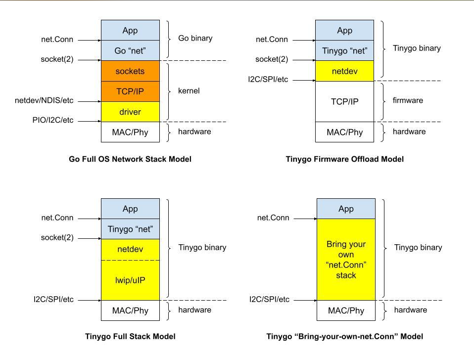

# cyw43439
Heapless driver for the Wifi+bluetooth integrated circuit on the pico.

## Examples
To run the blinky example:
```shell
tinygo flash -target=pico -stack-size=8kb -scheduler=tasks -monitor  ./examples/blinky
```

| To run Wifi examples you must first set your wifi credentials: |
|---|

1. Clone this repository

2. Create ssid.text and password.text files in the [`examples/common`](examples/common) directory. Write your SSID into ssid.text and WiFi password into password.text. Do not add final newlines to the files. If the password is empty then an open network is assumed.

3. Run any of the examples in the [`examples`](./examples) directory

    Example of how to run the DHCP example:
    ```shell
    tinygo flash -target=pico -stack-size=8kb -scheduler=tasks -monitor  ./examples/dhcp
    ```

### Debugging and heap allocations
The examples use the [`soypat/seqs` networking stack library](https://github.com/soypat/seqs/). One can enable heap debugging by using the `debugheaplog` build tag:

Example:
 ```shell
tinygo flash -target=pico -stack-size=8kb -scheduler=tasks -monitor -tags=debugheaplog  ./examples/dhcp
```
This will use a simpler logger implementation within the `seqs` package that avoids all allocations and will also log heap increments on lines starting with the `[ALLOC]` text.


## Contributions
PRs welcome! Please read most recent developments on [this issue](https://github.com/tinygo-org/tinygo/issues/2947) before contributing.

## FYI
* [RP2040 datasheet](https://datasheets.raspberrypi.com/rp2040/rp2040-datasheet.pdf).

* [CYW43439 datasheet](https://www.infineon.com/dgdl/Infineon-CYW43439-DataSheet-v03_00-EN.pdf?fileId=8ac78c8c8386267f0183c320336c029f)

* [Pico SDK github repo](https://github.com/raspberrypi/pico-sdk)
    * [`pico_w.h`](https://github.com/raspberrypi/pico-sdk/blob/master/src/boards/include/boards/pico_w.h)
    
    * [`cyw43_driver/cyw43_bus_pio_spi.c`](https://github.com/raspberrypi/pico-sdk/blob/master/src/rp2_common/cyw43_driver/cyw43_bus_pio_spi.c): Core driver for interfacing directly with the CYW43439. This is what this repo will target in the port. 
    
    * [`pico_cyw43_arch`](https://github.com/raspberrypi/pico-sdk/blob/master/src/rp2_common/pico_cyw43_arch): Architecture for integrating the CYW43 driver (for the wireless on Pico W) and lwIP (for TCP/IP stack) into the SDK. It is also necessary for accessing the on-board LED on Pico W.
        * [`pico_cyw43_arch/include/pico/cyw43_arch.h`](https://github.com/raspberrypi/pico-sdk/blob/master/src/rp2_common/pico_cyw43_arch/include/pico/cyw43_arch.h): Headers for the architecture driver. Has a **very complete comment** introducing the architecture library.

### Peripheral side APIs
Examples:
* [APA102](https://www.pololu.com/product/2554) addressable LED strip. 
    - Here is the [Go driver](https://github.com/tinygo-org/drivers/blob/release/apa102/apa102.go): well programmed and simple. Follows good practices like storing buffers in-struct as arrays (`buf` field) to avoid heap allocations and encouraging better CPU memory access patterns.
    - I could not find a high quality C or C++ driver, there seems to be a different driver for each microcontroller. [Here's an ESP8266](https://github.com/leonyuhanov/esp8266apa102driver/blob/master/apa102LEDStrip.cpp) driver for the APA102 which seemed reasonably well programmed.
* [Wifinina SPI driver](https://github.com/tinygo-org/drivers/tree/release/wifinina) for ESP32 wifi with TCP/IP.


### Microcontroller side APIs
The CYW43439 driver will have minimal microcontroller side API code, though it does not hurt to read up a little bit on it.

It may be of interest to the reader to know a bit of how one ports microcontroller specific code from C to Go. This code is characterized by the heavy use of [volatile memory registers](https://github.com/tinygo-org/tinygo/blob/c7a23183e822b9eebb639902414a0e08a09fbba0/src/machine/machine_rp2040_pwm.go#L40-L44) and [data structures that map peripheral functionality directly](https://github.com/tinygo-org/tinygo/blob/c7a23183e822b9eebb639902414a0e08a09fbba0/src/machine/machine_rp2040_pwm.go#L54) to these segments of volatile memory.

For the case of the RP2040 (the raspberry pi's pico microcontroller) one can find most of microcontroller specific code in the [TinyGo `machine` package](https://github.com/tinygo-org/tinygo/tree/release/src/machine)- Look for filenames starting with `machine_rp2040`. In the author's opinion one of the cleanest peripheral API's is the RP2040's I2C driver, which you may find in [`machine_rp2040_i2c.go`](https://github.com/tinygo-org/tinygo/blob/release/src/machine/machine_rp2040_i2c.go) in said package.

The C counterparts are in the [pico-sdk's `rp2_common` directory](https://github.com/raspberrypi/pico-sdk/tree/master/src/rp2_common). The I2C counterpart includes the [header file](https://github.com/raspberrypi/pico-sdk/blob/master/src/rp2_common/hardware_i2c/include/hardware/i2c.h) with function signatures and type definitions... and more interestingly, the actual code under [`hardware_i2c/i2c.c`](https://github.com/raspberrypi/pico-sdk/blob/master/src/rp2_common/hardware_i2c/i2c.c). Do note the port is *almost* direct. Some functions have been grouped differently and have slightly different signatures in the `Go` version.

The PWM API is much more closely matched between the [C](https://github.com/raspberrypi/pico-sdk/blob/master/src/rp2_common/hardware_pwm/include/hardware/pwm.h) and [Go](https://github.com/tinygo-org/tinygo/blob/release/src/machine/machine_rp2040_pwm.go) version, albeit much simpler.


### Go and TinyGo Ethernet/IP/TCP stack comparisons


### Install stringer command
```sh
go install golang.org/x/tools/cmd/stringer@latest
```
