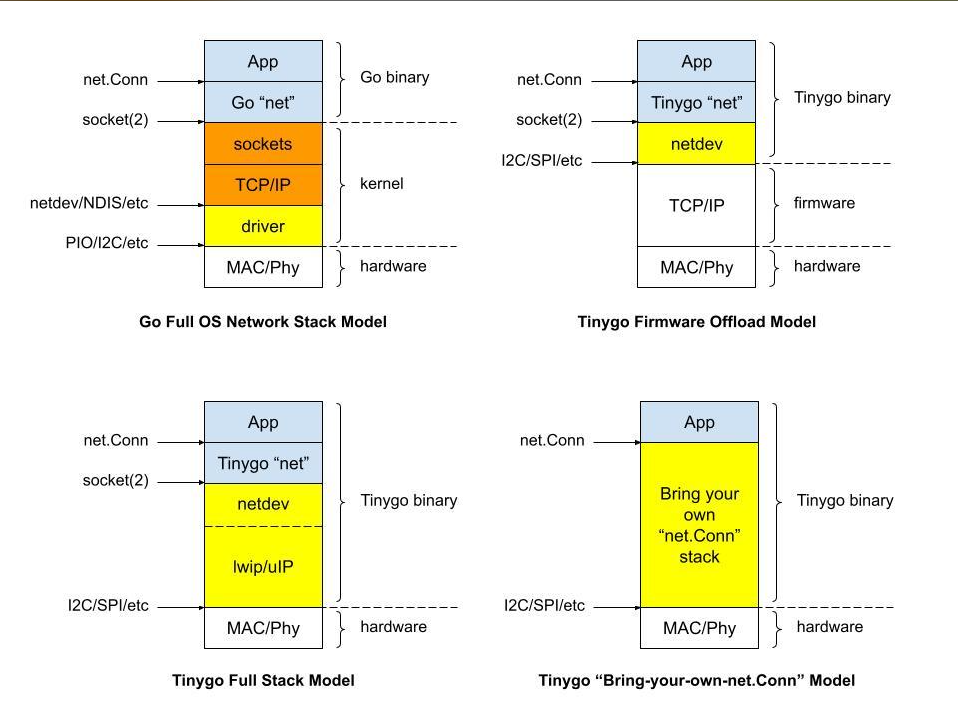

# cyw43439
Heapless driver for the Wifi+bluetooth integrated circuit on the pico.

Note for **Automate Your Home Using Go** book readers [below](#book-notes)! 

## Examples
To run the blinky example:
```shell
tinygo flash -target=pico -stack-size=8kb -scheduler=tasks -monitor  ./examples/blinky
```

| To run Wifi examples you must first set your wifi credentials: |
|---|

1. Clone this repository

2. Create ssid.text and password.text files in the [`examples/common`](examples/common) directory. Write your SSID into ssid.text and WiFi password into password.text. Do not add final newlines to the files. If the password is empty then an open network is assumed.

3. Run any of the examples in the [`examples`](./examples) directory

    Example of how to run the DHCP example:
    ```shell
    tinygo flash -target=pico -stack-size=8kb -scheduler=tasks -monitor  ./examples/dhcp
    ```

## Developing/Debugging

### Stringer install
`stringer` used for enum string representation generation. Automated via running `go generate` in repo root:
```sh
go install golang.org/x/tools/cmd/stringer@latest
```

### Build Tags
| Build tag | Source | Effect |
|---|---|---|
| `debugheaplog` | [lneto](https://github.com/soypat/lneto#build-tags) | Enables verbose logging of networking stack with `[ALLOC]` tagged log lines on heap allocation detection. |
| `noslog` | [lneto](https://github.com/soypat/lneto#build-tags) | Omits `log/slog` package calls within networking library. Useful to cut down on binary size and omit `json` and `fmt` package inclusion in resulting binary. |
| `xnetdebug` | [lneto](https://github.com/soypat/lneto#build-tags) | Enables packet capture logging on all packets received and sent. |
| `cy43nopio` | `cyw43439` | For setting user defined PIO. Useful for non RP2 targets or if not using TinyGo. See [bus.go](bus.go) `cmdBus`. |

Example:
 ```shell
tinygo flash -target=pico -stack-size=8kb -scheduler=tasks -monitor -tags=debugheaplog,xnetdebug  ./examples/dhcp
```

### Go and TinyGo Ethernet/IP/TCP stack comparisons



## Contributions
PRs welcome! Please read most recent developments on [this issue](https://github.com/tinygo-org/tinygo/issues/2947) before contributing.

## Book notes

For **Automate Your Home Using Go** readers: Welcome! You will find the book examples still work but do note that you will be running a deprecated networking library called [seqs](https://github.com/soypat/seqs). The new examples use [lneto](https://github.com/soypat/lneto) and have noticeably diverged from seqs style. The historical reasons for the drift is explained in a [FOSDEM talk on youtube](https://www.youtube.com/watch?v=-u0X8MWXkeg). 

If you wish to return to the world of seqs and follow the examples in the book verbatim feel free to simply check out the commit right before [lneto support was merged](https://github.com/soypat/cyw43439/commit/21f94a8d9a5ec70d476a52d13573aaaf5887eb93):

```sh
git checkout 0a1d121ea3
```